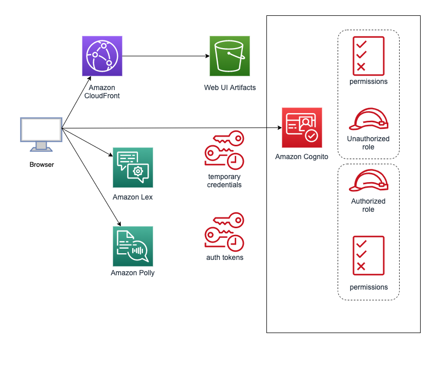

# Lex Chatbot Web Interface

> Sample Lex Chatbot Web Interface Application

## Overview
This application provides a sample chatbot web interface for [Amazon
Lex](https://aws.amazon.com/lex/). It is a responsive user interface that
can be run as a mobile friendly stand-alone web app or embedded into an
existing site using an iframe. The interface supports interacting with
Lex using text and voice.

## Application Architecture
The chatbot interface is a JavaScript driven web application.
It works by making calls to the Lex service directly from a
user's browser using temporary credentials obtained from [Amazon
Cognito](https://aws.amazon.com/cognito/). This allows the chatbot web app
to be served from S3 or CloudFront in a scalable serverless architecture.
Here is a diagram of how the application works:



### Dependencies
The chatbot web app is built using the [Vue.js](https://vuejs.org/)
JavaScript framework. The user interface is structured as modular
components using [Vuetify.js](https://vuetifyjs.com/). The application
state management is done using [Vuex](https://vuex.vuejs.org/en/). The
code base employs ECMAScript 6 (ES6) features such as modules, arrow
functions and classes to improve modularity and brevity.

### Library
The chatbot UI provides a library that can be used as a Vue plugin.
It adds a property named `$lexWebUi` to the Vue class and registers
a global Vue component name `LexWebUi`.

You can import the library as a module and use it in your code:
```
  // dependencies
  import Vue from 'vue';
  import Vuex from 'vuex';
  import Vuetify from 'vuetify';

  // import the component constructor
  import { Loader as LexWebUi } from 'aws-lex-web-ui';

  Vue.use(Vuetify);
  Vue.use(Vuex);

  // plugin creates the LexWebUi component
  const lexWebUi = new LexWebUi();

  // instantiate Vue
  const vm = new Vue({
    el: '#lex-web-ui',

    // vuex store is in the lexWebUi instance
    store: lexWebUi.store,

    // you can use the global LexWebUi/<lex-web-ui> commponent in templates
    template: `
      <div id="lex-web-ui-app">
        <lex-web-ui
          v-on:updateLexState="onUpdateLexState"
        ></lex-web-ui>
      </div>`,
    methods: {
      onUpdateLexState(lexState) {
        // handle lex state change events
      },
    },
  });

  /*
  You will need to import the CSS depdendencies as well:

    @import 'node_modules/vuetify/dist/vuetify.min.css';
    @import 'node_modules/aws-lex-web-ui/dist/lex-web-ui.css';
  */
```

Alternatively, for finer control, you can use the Vue plugin directly
in your application as show below. Note as of verion 0.14.5, the lexRuntimeClient will
be dynamically reinitialized using the region configured or specified in the cognito poolId. 
Make sure that the Cognito Identity Pool is provisioned in the same region as the LexBot.
Mixing regions is not supported.
```
  import Vue from 'vue';
  import Vuex from 'vuex';
  import Vuetify from 'vuetify';
  import { Config as AWSConfig, CognitoIdentityCredentials }
    from 'aws-sdk/global';
  import LexRuntime from 'aws-sdk/clients/lexruntime';
  import Polly from 'aws-sdk/clients/polly';

  import { Plugin as LexWebUi, Store as LexWebUiStore } from 'aws-lex-web-ui';

  Vue.use(Vuex);
  Vue.use(Vuetify);

  const store = new Vuex.Store(LexWebUiStore);

  // see the configuration section for details about the config fields
  const config = {
    ui: { toolbarLogo: '', toolbarTitle: 'My Bot' },
    iframe: { iframeOrigin: '' }
  };

  Vue.use(LexWebUi, { config });

  /*
    You can now use the '<lex-web-ui>' tag in your Vue templates The
    'LexWebUi' component is global to the Vue instance. You can access
    the lexWebUi plugin instance in your components as 'this.$lexWebUi'.

    Make sure to add the 'store' variable as the vuex store to your Vue
    instance or component.

    The '<lex-web-ui>' component emits 'updateLexState' events everytime
    the Lex state changes. The parent component can handle these events
    using 'v-on' to grab the current Lex state.

    You will need to import CSS dependencies into your project:
    @import 'node_modules/vuetify/dist/vuetify.min.css';
    @import 'node_modules/aws-lex-web-ui/dist/lex-web-ui.css';
  */
```
#### Adding New Dependencies
To add new dependencies you will need to add them to the lex-web-ui Vue plugin.  This can be done in 'lex-web-ui/lex-web-ui.js'. By adding them via the VueConstructor.  For example to add a depency such as [VueMask](https://www.npmjs.com/package/v-mask) From within the 'lex-web-ui' directory npm install v-mask.  Then ```import VueMask from 'v-mask'``` finally at the bottom of the file add ```VueConstructor.use(VueMask)```.  Now VueMask will be available throughout the entire UI.

## Sound Effects
You can enable sound effects when a message is sent or received. This
feature also enables a sound button in the toolbar that can be used to
mute the sound effects.
```
  "ui": {
    "enableSFX": true,
    // uri to sound files
    "messageSentSFX": "sent.mp3",
    "messageReceivedSFX": "received.mp3",
  }
```

## Markdown and HTML Support 
The chatbot UI supports HTML and Markdown in bot responses. Markdown can be provided in
one of two methods. 

First, Lex added support for Markdown using the new CustomPayload 
features available in the AWS Lex Console. The lex-web-ui will render Markdown supplied as
a CustomPayload. 

Second, the lex-web-ui will render Markdown supplied via the 
appContext.altMessages.markdown attribute described below. This method was previously 
supported by the lex-web-ui and will supported going forward. However, the native Lex
capability is the recommended approach for supplying Markdown. 

Markdown is rendered to 
HTML using [marked](https://www.npmjs.com/package/marked) and then displayed to the 
user. To do this you must configure the chat UI and have your bot place the HTML 
and/or Markdown messages the response message's session attributes.

To utilize the second approach configure and use the following:

* Set the `ui.AllowSuperDangerousHTMLInMessage` config field to `true`. __WARNING__: Enabling this feature increases the risk of XSS. Make sure that the HTML/Markdown message has been properly escaped/encoded/filtered in the Lex Handler Lambda function. For more information on XSS see [here](https://www.owasp.org/index.php/Cross-site_Scripting_(XSS))

* If using markdown to render images or video from another domain, add those domains as a space seperated list in the Cloudformation template `MarkdownSupportDomains` field - this will update the Cloudfront security headers to allow those domains.

* Program you lambda function to provide your Markdown and HTML messages as alt-messages in the session attribute `appContext.altMessages`. For example your session attribute could look like this or markdown messages:

```
{
    "appContext":{
        "altMessages":{
            "markdown":"# hello!"
        }
    }
}
```

or this for html messages:

```
{
    "appContext":{
        "altMessages":{
            "html":"<h1>hello!</h1>"
        }
    }
}
```

The following priority exists for Markdown or Html content supplied in any of the two 
methods. Highest priority first.

1. All Lex based CustomPayloads will override any values found in appContext.altMessages.
2. HTML provided via appContext.altMessages
3. Markdown provided via appContext.altMessages 

The standard message returned from Lex will not be shown if any content exists from any of Markdown
or HTML mechanisms. 

## Configuration and Customization
The chatbot UI requires configuration parameters pointing to external
resources such as the Lex bot name and the Cognito Identity Pool Id
(this repo includes CloudFormation templates to create these Cognito and
Lex resources). Additionally, you may want to pass parameters to change
the default run time configuration (e.g. look and feel).

This configuration can come the sources listed below (by order of
precedence where the latter overrides the previous).

1. Default Configuration Object
2. Build Time Configuration
3. Run Time Configuration
    1. URL Parameter
    2. Loader Config

See the sections below for details about each one.

### Default Configuration Object
The base configuration comes from the `configDefault` object in the
[src/config/index.js](src/config/index.js) script. This script controls
customizable UI looks (e.g. colors, titles), behavior (e.g. recorder
settings) and runtime parameters (e.g. Lex bot name). It exports an
object that is the source of all available configurable options that
the chatbot UI recognizes and their initial values.

**NOTE**: To avoid having to manually merge future changes, you probably
do not want to modify the values in the `src/config/index.js` file. You
should instead pass your own configuration using the mechanisms listed
in the following sections.

### Build Time Configuration
The chatbot UI build process can import configuration from a JSON
file. This is done when [webpack](https://webpack.github.io/) bundles
the chatbot UI files (normally done using `npm run build`).

This JSON config file should contain the the same key/value structure
as the `configDefault` object in the `src/config/index.js` file. Its
content is merged with the values of `configDefault` overriding the
initial values.

The JSON config files reside under the `src/config` directory. They
follow the naming convention: `config.<ENV>.json` where `<ENV>`
depends on the on the environment type as determined by the `NODE_ENV`
environmental variable (e.g. development, production). This allows to
pass a configuration that is specific to the specific build or runtime
environment. The files follow this directory structure:

```
.
|__ src
   |__ config
      |__ config.dev.json   # local development config
      |__ config.prod.json  # production config
      |__ config.test.json  # testing config
```

Here's an example of the `config.dev.json` file:

```
{
  ui: { parentOrigin: '' },
  iframe: {
    iframeOrigin: '',
    iframeSrcPath: '',
  },
};
```

**NOTE**: The CloudFormation templates included in this repo create
a pipeline that uses CodeBuild. The CloudFormation stack created by
these templates passes various parameters as environmental variables to
CodeBuild. These environmental variables are used by CodeBuild to populate
values in the JSON files described above. For example, when the stack
creates a Cognito Pool Id, the Pool Id is passed to CodeBuild which in
turn modifies the JSON files described above. Please take into account
that CodeBuild may override the values in your files at build time.

**NOTE**: The configuration parameters in the JSON file are visible in the
browser - configurations should never contain sensitive data.

### Run Time Configuration
The chatbot UI can be passed dynamic configuration at run time. This allows
to override the default and build time configuration.

#### URL Parameter
The chatbot UI configuration can be initialized using the `lexWebUiConfig` URL
parameter. This is mainly geared to be used in the stand-alone mode of
the chatbot UI (not iframe).

The `lexWebUiConfig` URL parameter should follow the same JSON structure of the
`configDefault` object in the `src/config/index.js` file. This parameter
should be a JSON serialized and URL encoded JavaScript object. Values
from this parameter override the ones from the environment config files.

For example to change the initialText config field, you can use a URL
like this:

`https://mybucket.s3.amazonaws.com/index.html#/?lexWebUiconfig=%7B%22lex%22%3A%7B%22initialText%22%3A%22Ask%20me%20a%20question%22%7D%7D`

You can encode the `lexWebUiConfig` URL parameter like this:
```
var lexWebUiConfig = JSON.stringify({
  lex: {
    initialText: 'Ask me a question',
  }
});

var query = 'lexWebUiConfig=' + encodeURIComponent(lexWebUiConfig);
var url = 'https://mybucket.s3.amazonaws.com/index.html#/?' + query;
var lexWebUiWindow = window.open(url, 'Lex Web UI', 'width=400', 'height=500');
```

#### Loader Config
This project provides a separate library used to load the component in
an existing web page. The loader library supports various mechanisms
used to pass the config dynamically. See the [ChatBot UI Configuration
Loading](/src/README.md#chatbot-ui-configuration-loading) section of
the loader documentation for details.

### Logos
You can change the default logo and favorite icon images by placing
your own images in `src/assets/logo.(png|jpe?g|svg)` and
`src/assets/favicon.(png|jpe?g|svg|ico)`
respectively. The favorite icon is set to the logo image if the
`src/assets/favicon.*` file is not found.

Alternatively, you can set the `ui.toolbarLogo` and `ui.favIcon` fields
in the config files to an image URL.

## Dependencies and Build Setup
The application dependencies are managed using
[npm](https://www.npmjs.com/). The build artifacts are bundled using
[webpack](https://webpack.js.org/). Initial scaffolding of this project
was done with [vue-cli](https://github.com/vuejs/vue-cli).

For detailed explanation on how things work, checkout the
[guide](http://vuejs-templates.github.io/webpack/) and
[docs for vue-loader](http://vuejs.github.io/vue-loader).

``` bash
# these commands should be executed under the lex-web-ui directory
# at the root of this repo

# install dependencies
npm install

# serve with hot reload at localhost:8080 no-eslint
npm run start

# serve with hot reload at localhost:8080
npm run dev

# build for production with minification no-eslint
npm run build

# build for production and view the bundle analyzer report
npm run build --report

# run unit tests
npm run unit

# run e2e tests
npm run e2e

# run all tests
npm test
```
